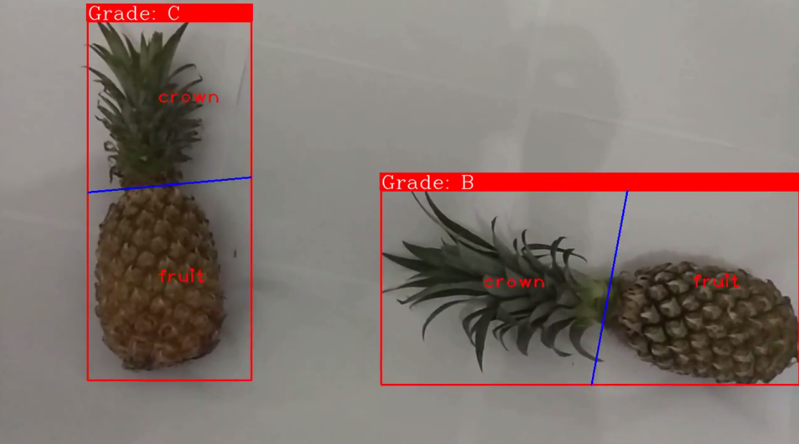

# Pineapple-Grading-Software
### Still on progress

The source codes of realtime pineapple grading software (based on maturity), it is written in c++ and depend on opencv library. It is suitable for belt conveyor grading system in industry.

[Project Video](https://www.youtube.com/watch?v=d7238va97eQ)

